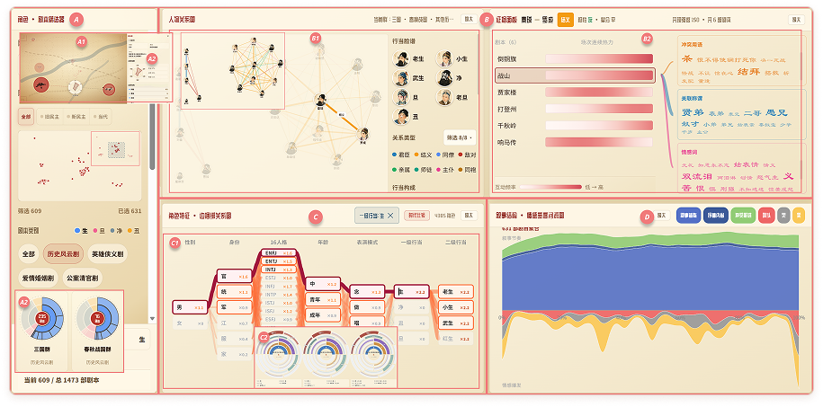

# Project Overview

**"京剧经纬" (Jingju Jingwei)** is an interactive visual analytics system for exploring Beijing Opera scripts through the lens of data science. The project was awarded **Second Prize** in Competition Track I (Data Visual Analysis and Humanistic Creativity) at [ChinaVis 2026](https://chinavis.org/2026/en/), one of the premier data visualization competitions in China.

**Team Members**: Duan Linpei, Li Quan (Advisor), Zhu Yichao, Quan Yuanchang, Ye Jiongjie, Gao Kehong, Liu Linjia

## Background

Beijing Opera (京剧), as a cornerstone of Chinese intangible cultural heritage, integrates literature, performance, music, and historical narratives. With the growing availability of digitized opera scripts, there is a unique opportunity to apply computational methods to uncover structural patterns, character dynamics, and thematic evolution that traditional close-reading approaches may overlook.

## What We Built

"京剧经纬" combines natural language processing, complex network analysis, and temporal visualization to enable multi-dimensional exploration of Beijing Opera scripts. The system supports:

- **Character Relationship Networks**
- **Thematic and Sentiment Analysis**
- **Narrative Structure Visualization**
- **Cross-Script Comparative Analysis**
- **Interactive Exploration Interface**